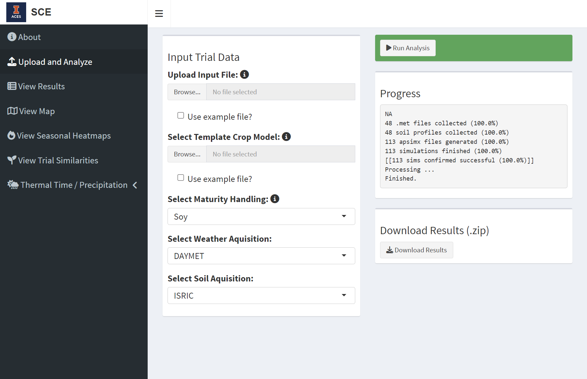
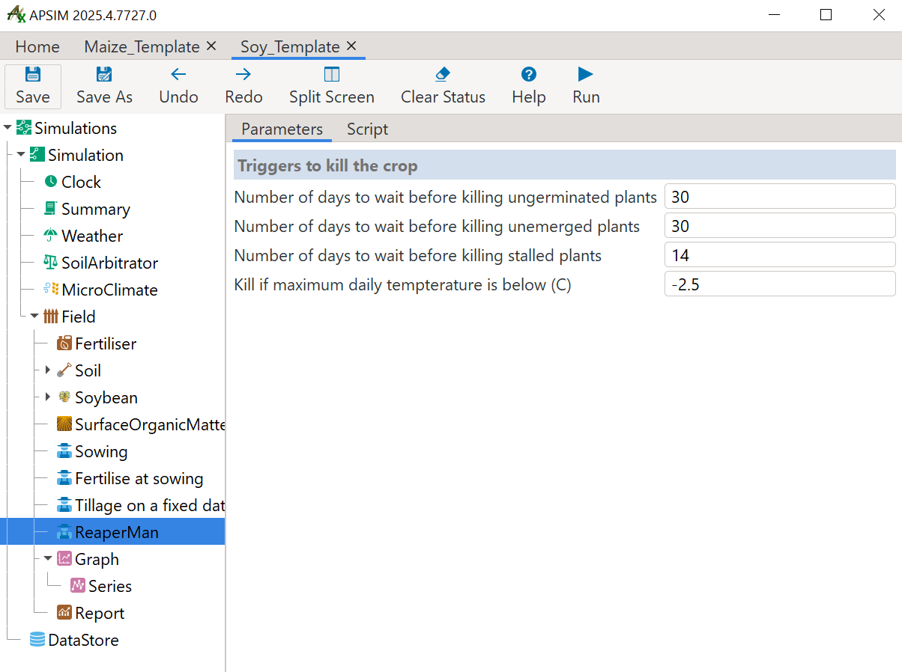
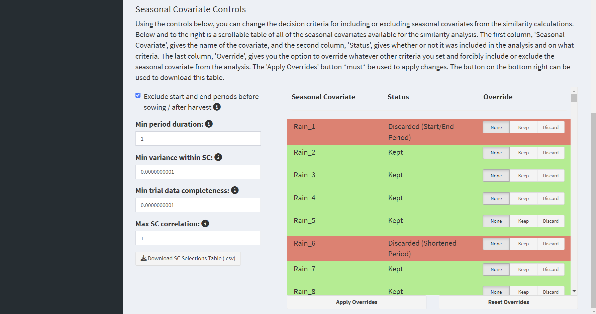

# 1. Overview

The Seasonal Characterization Engine, or SCE, consists of two major files: the SCE app and an analysis script. Through the app, the user provides trial parameters and a template crop model for the trial simulations. The analysis script accesses public APIs to collect appropriate weather and soil data, generates APSIM model files according to the user's parameters, runs the simulations through Next-Gen APSIM, and returns model outputs summarized by stage of development. This allows the script to return climatic variables (ex: precipitation, temperature, humidity) and modeled stresses (ex: predicted water stress, heat stress, total stress) according to their intersection with the crop's phenology.

*Acknowledgment is made to the APSIM Initiative which takes responsibility for quality assurance and a structured innovation program for APSIM's modelling software, which is provided free for research and development use (see www.apsim.info for details).*

The SCE app requires internet access in order to be able to gather soil and weather information.

# 2. Installation

## 2.1. Building from the Docker File

For the sake of reproducibility, the SCE app is bundled with a Dockerfile and the files necessary to build the working environment. "renv.lock" contains the versioned R packages; the folder "next_gen_apsim" contains the files for the Next-Gen APSIM distribution. In the case that packages and software become outdated, building from the Dockerfile allows you to replicate the app in its original environment.

To run the app as a Docker container:

1.  [Install Docker](https://docs.docker.com/get-started/get-docker/), if you don't have it.
2.  Download the SCE from its GitHub directory as a .zip file. Extract the file.
3.  Through your terminal, navigate into the extracted folder and run `docker build -t sce-app .`
4.  When the image has been built, run `docker run -p 3838:3838 sce-app`
5.  Open a browser. The application should be available at <http://localhost:3838/>.

## 2.2. Running the App Directly

1.  Download the SCE from its GitHub directory as a .zip file. Extract the file.
2.  [Download and install a copy of Next-Gen APSIM,](https://www.apsim.info/download-apsim/) if you don't have one.
3.  [Download and install a copy of R,](https://cran.r-project.org/bin/windows/base/) if you don't have one. Downloading an IDE like [RStudio](https://posit.co/downloads/) may also be convenient.
4.  Open R or your R IDE. From the R console, run the command `setwd()` and set the working directory to the path of the extracted SCE folder. Ex: `setwd("example/path/to/SCE-main")`.
5.  Run the command `shiny::runApp()`. The application should open.

# 3. User Control

::: {style="text-align: center; font-size: 90%; margin-top: 0.5em; margin-bottom: 1.5em;"}

The "Upload and Analyze" tab.

:::

User control of the SCE can be performed on the second page of the application, the "Upload and Analyze" tab. User inputs are set with controls in the "Input Trial Data" box. A highlighted button at the upper right runs the analysis once requirements are met. The "Progress" box tracks the progress of the analysis script, and a "Download Results" button allows the user to download the final datasets in a .zip file.

## 3.1. The Input File

In the "Input Trial Data" box, the user is prompted to upload the input file, which provides the trial information. Trial information is formatted as a .csv file with the columns "Site", "Latitude", "Longitude", "Planting", and "Genetics". Example input files for maize and soybean are provided in the "example_input_files" directory.

Each row of the file represents an individual trial and its parameters. "Site" is the identifier for that location, and "Latitude" and "Longitude" are the WGS84 coordinates. "Planting" is when the crop should be planted in the simulation, and can be entered as a date in YYYY-MM-DD format or as a year, in which case the crop will be sown when the model determines that the conditions in that year and location have become suitable. The final column, "Genetics", represents the cultivar maturity genetics and must be formatted differently depending on the maturity system used. The section below on Maturity Handing provides more information.

## 3.2. The Template Model

Under the trial data upload, the user selects the template crop model as a base for the seasonal characterization. The SCE is distributed with the "Maize_Template.apsimx" and "Soy_Template.apsimx" template models in the "template_models" directory. The user may also choose a custom crop model to use with the engine: we recommend modifying either of the existing template files and swapping out crop modules and/or adjusting management controls and reporting variables as desired.

## 3.3. Maturity Handling

Under "Select Maturity Handling", the user can choose which system the script should use to translate the "Genetics" information in the input file into cultivar maturities. This in turn determines the cultivar parameter files that the APSIM simulations use to set the phenology of each trial. The three options for maturity handling are "Maize", "Soy", and "Direct". "Maize" is intended to be used with the "Maize_Template" model, "Soy" with the "Soy_Template" model, and "Direct" with any other custom model.

### 3.3.1. Maize Maturity Handling

For the "Maize" option, the "Genetics" values of the input file should be taken from the cultivar RM and formatted as character string of A or B and a number of growing degree days (ex: "B_100", "A120", "B 95", etc., are all acceptable). Maize maturity is handled through binning: the RM values of the inputs are matched to their closest available maturities in the generic Maize A and B cultivars.

### 3.3.2. Soy Maturity Handling

For the "Soy" option, the "Genetics" values of the input file should be formatted as a decimal RM where the floor of the value corresponds to the cultivar's maturity group classification. RM values 0 -- 0.999, 1 -- 1.999, 2 -- 2.999, etc., translate to maturity groups "0", "I", "II", etc. The tool supports maturities 000 -- X, with 000 available as RM values -2 -- -1.001 and 00 available as values -1 -- -0.001.

For any cultivar in the input file within maturity designations 000 -- VII ("Genetics" / RM value -2 -- 7.999), the decimal part of the RM value is used to classify the cultivar into a "early", "mid", or "late" variant of the base maturity. Decimal values within 0.001 -- 0.333, 0.334 -- 0.666, and 0.667 -- 0.999 translate to the "early", "mid", and "late" variants respectively.

**Because the soybean RM handling uses a decimal system, when entering a soybean cultivar which broadly belongs to a maturity group (e.g., a "maturity two"), it's more appropriate to enter the value incremented by 0.5 (e.g., 2.5, a "mid" maturity two) than the exact value (e.g., 2.0, an early maturity two).**

For maturities VIII -- X, the SCE's template soybean model uses the APSIM generic cultivars that match those maturities. For maturities 000 -- VII, however, the template soybean model uses a set of custom cultivars with new maturity parameters. These maturity parameters were calibrated from phenological data shared by GDM Seeds Inc., from the records of their North American soybean breeding program.

### 3.3.3. Direct Maturity Handling

For the "Direct" maturity handling option, the "Genetics" values of the input file should be the exact names of the APSIM cultivars which the user would like to use for the trial simulation.

## 3.4. Weather and Soil Acquisition

The user may select from drop down menus the source of their weather data and the source of their soil. The provided options for weather acquisition are DAYMET, CHIRPS, and NASAPOWER; the provided options for soil acquisition are SSURGO and ISRIC. Users should be mindful that DAYMET and SSURGO are limited to retrieving data for points within the United States.

## 3.5. (Advanced) Embedded Management Scripts Defining Simulation Limits

Outside the app's interface, the template models provided with the project contain two custom management scripts that allow finer control of the parameters for starting and ending trials.

### 3.5.1. "Sowing": Sowing Date Determination

::: {style="text-align: center; font-size: 90%; margin-top: 0.5em; margin-bottom: 1.5em;"}

Inputs and controls for the "Sowing" management script.

:::

The management script "Sowing" determines the sowing date of the trial if only the year is provided. When accessed through the APSIM interface, the user can adjust parameters for variable sowing: the start and end of the sowing window, minimum extractable soil water required, accumulated rainfall required, required duration of rainfall accumulation, and required soil temperature. The user can also choose to enforce sowing by the end of the sowing window if sowing conditions are not met.

### 3.5.2. "ReaperMan": Environmental Parameters for Ending Crops

::: {style="text-align: center; font-size: 90%; margin-top: 0.5em; margin-bottom: 1.5em;"}

Inputs and controls for the "ReaperMan" management script.
:::

The second custom script is "ReaperMan", a management script for ending trials. A current limitation of the base APSIM soybean and maize models is the lack of environmental mortality: plants will simply survive through otherwise lethal conditions and resume growth when conditions are amenable. Because of this, this script is intended as a common sense check for whether the crop should be ended.

The management script has several adjustable triggers derived from the environmental mortality parameters of the previous generation APSIM application (Apsim7.10). The parameters include the number of days to wait before ending a crop that hasn't germinated, a crop that hasn't emerged, or a crop which is no longer developing. The final parameter is the minimum temperature in degrees Celsius that the maximum daily temperature must exceed, or the crop will be declared dead from a hard frost.

# 4. Workflow of the Seasonal Characterization Engine

Once the required inputs have been provided, the user clicks the "Run Analysis" button to begin the process. Progress for each stage of the script is tracked in a box below.

## 4.1. Processing Inputs

::: {style="text-align: center; font-size: 90%; margin-top: 0.5em; margin-bottom: 1.5em;"}

A diagram of the SCE's process for translating the user inputs (in blue) into the parameters used to generate the future trial simulations. The parameters of each trial simulation are stored in a row of the parameter file (in purple). A location ID (in pink) links each trial to a matching APSIM soil profile (in yellow) and a .met file which contains weather information (in orange).

:::

The SCE script begins by processing the input trial data to get the parameters of each of the trial simulations. "Planting" is used to set the year of the trial and specific planting date if it exists. The initial boundaries (start / end) of each simulation are the first and last day of the year it takes place in.

The SCE script creates a list of location IDs representing unique trial locations. The script queries the chosen weather database and creates .met files, in parallel, for each unique location. Each .met file contains the weather data needed to cover any trials associated with that location, plus the last ten years of daily weather information. These last ten years will be used for describing "typical growing season" in the "Thermal Time / Precipitation" tab of the application. The .met files are stored in the "apsimx_output/met" directory and appended with the location ID.

The script then queries the chosen soil database and creates an APSIM soil profile for each location. These files are stored in the "apsimx_output/soils" directory and similarly appended with the location ID.

Using the "Maturity Handling" decision given earlier (Maize/Soy/Direct), the app runs the appropriate function and converts the values in the "Genetics" column of the trial input file to the internal names of APSIM cultivars. The maturity definitions of these cultivars are used to used to set the phenology of each of the simulated trials. These cultivar names are stored under "Mat" in the final trial_info file.

## 4.2. Creating and Processing Trial Simulations

::: {style="text-align: center; font-size: 90%; margin-top: 0.5em; margin-bottom: 1.5em;"}

A diagram of the SCE process for creating and running trial simulations. The user provides a template .apsimx model (in blue), which contains the crop module and management scripts. This template is copied and overwritten according to the previously generated trial sim parameters to create new trial simulation files. Each new simulation is run through APSIM and its outputs stored separately.

:::

The SCE script uses the chosen template model to generate the individual trial simulations. For each row of the input file, the script edits a copy of the chosen template model according to the specified trial parameters and attaches the appropriate weather and soil information. The script then splits these simulations into batches and runs them in parallel through the Next-Gen APSIM application. The simulations and their outputs are stored under "apsim_outputs/apsim" directory in individual folders labeled with the trial ID.

## 4.3. Processing Trial Outputs

::: {style="text-align: center; font-size: 90%; margin-top: 0.5em; margin-bottom: 1.5em;"}

A diagram of the SCE process for aggregating raw simulation outputs into the final outputs. Each table headed in green represents a data frame returned to the user.

:::

When all simulations are finished, the script summarizes the descriptive parameters over the simulated phenology of the crop. The reporting variables are aggregated by "Period." These periods correspond to the Next-Gen APSIM phenological phases, with the addition that the first period contains two weeks before planting until planting / germination, and the final period contains from when the crop is ready to harvest until two weeks after the harvest.

# 5. Outputs

The final result of the analysis are five output files. These can be downloaded from the "Upload and Analyze" tab once the analysis is finished, and are stored in the application directory under "output_files/results". (Please note that if a new analysis is run, these directory files will be overwritten! Remember to save your work.)

## 5.1. Output Files

|                         |                                                                                                                                                                                                                                                                                                           |
|--------------------------|----------------------------------------------|
| **File Name**           | **Contents**                                                                                                                                                                                                                                                                                              |
| "daily_sim_outputs.csv" | The combined total output of the APSIM simulations. This file contains the recorded values of the reporting variables for each day of each simulation. This data is available for users who wish to access the raw outputs of the tool.                                                                   |
| "seasonal_data.csv"     | The seasonal profiles. Contains the seasonal covariates for each trial (environmental and biological parameters summarized by period) as well as parameters which describe the periods themselves, such as starting and end date. This data is in long format by ID and period.                           |
| "trial_info.csv"        | Trial and simulation summary information. This file aligns with the input trial data and contains the trial simulation's parameters, as well as any other information which applies to the trial as a whole.                                                                                              |
| "final_x.csv"           | This file joins the contents of trial_info and seasonal_data, and contains the full outputs of the seasonal characterization engine in wide format. The naming convention of period-specific parameters is "Variable_Period", e.g., "Rain_5" is the mean rainfall within the fifth period of development. |
| "period_key.csv"        | Gives the numbered periods and the APSIM stages they are associated with in the template model. These are used to map the period codes to crop development.                                                                                                                                               |

## 5.2. Variables of seasonal_data

The default reporting variables of seasonal_data are:

|                   |                  |                                                                                                                                                                                                                                                                                                                                                                                                                                    |
|-------------------|-------------------|----------------------------------|
| Name              | Unit             | Description                                                                                                                                                                                                                                                                                                                                                                                                                        |
| ID                | (unitless)       | ID of the simulation. This matches the row number of the input file.                                                                                                                                                                                                                                                                                                                                                               |
| Period            | (unitless)       | Period of development. Equivalent to APSIM stages of development.                                                                                                                                                                                                                                                                                                                                                                  |
| Rain              | mm               | Mean daily rainfall during that period, summarized from [Weather].Rain.                                                                                                                                                                                                                                                                                                                                                            |
| AccRain           | mm               | Total rainfall accumulated within that period, summarized from [Weather].Rain.                                                                                                                                                                                                                                                                                                                                                     |
| Radn              | mJ/m²            | Mean daily radiation during that period, summarized from [Weather].Radn.                                                                                                                                                                                                                                                                                                                                                           |
| MaxT              | °C               | Mean of maximum daily temperatures during that period, summarized from [Weather].MaxT.                                                                                                                                                                                                                                                                                                                                             |
| MeanT             | °C               | Mean of daily temperatures during that period, summarized from [Weather].MeanT.                                                                                                                                                                                                                                                                                                                                                    |
| MinT              | °C               | Mean of minimum daily temperatures during that period, summarized from [Weather].MinT.                                                                                                                                                                                                                                                                                                                                             |
| ThermalTime       | GDD              | Mean daily thermal time within that period, summarized from [Crop].Phenology.ThermalTime.                                                                                                                                                                                                                                                                                                                                          |
| AccTT             | GDD              | Total thermal time accumulated within that period, summarized from [Crop].Phenology.ThermalTime.                                                                                                                                                                                                                                                                                                                                   |
| AccEmTT           | GDD              | Total thermal time accumulated since the crop's emergence, as reported by [Crop].Phenology.AccumulatedEmergedTT.                                                                                                                                                                                                                                                                                                                   |
| SoilTemp          | °C               | Mean of daily soil temperature in the second soil layer during that period, as reported by Soil].Temperature.Value[2].                                                                                                                                                                                                                                                                                                             |
| PAWmm             | mm               | Mean of daily total plant available water within the soil profile during that period, summarized from sum([Soil].Water.PAWmm).                                                                                                                                                                                                                                                                                                     |
| NH4               | kg/ha            | Mean of daily total ammonium content within the soil profile during that period, summarized from sum([Soil].NH4).                                                                                                                                                                                                                                                                                                                  |
| NO3               | kg/ha            | Mean of daily total nitrate content within the soil profile during that period, summarized from sum([Soil].NO3).                                                                                                                                                                                                                                                                                                                   |
| Urea              | kg/ha            | Mean of daily total urea content within the soil profile during that period, summarized from sum([Soil].Urea).                                                                                                                                                                                                                                                                                                                     |
| OrganicC          | kg/ha            | Mean of daily total organic carbon content within the soil profile during that period, summarized from sum([Nutrient].Organic.C).                                                                                                                                                                                                                                                                                                  |
| FracGrowth        | (unitless)       | Mean daily fractional growth rate during that period, summarized from [Leaf].FRGR. Daily [Leaf].FRGR is the minimum of the values of NutrientStress ([Photosynthesis].FN), TempStress ([Photosynthesis].FT), and WaterStress ([Photosynthesis].FW) on that day. Each of these variables are measured on a scale from 1 to 0, where 1 indicates no inhibition of photosynthesis and 0 indicates total inhibition of photosynthesis. |
| NutrientStress    | (unitless ratio) | Value of [Photosynthesis].FN, the coefficient of nutritional stress on potential photosynthesis.                                                                                                                                                                                                                                                                                                                                   |
| TempStress        | (unitless ratio) | Value of [Photosynthesis].FT, the coefficient of air temperature stress on potential photosynthesis.                                                                                                                                                                                                                                                                                                                               |
| WaterStress       | (unitless ratio) | Value of [Photosynthesis].FW, the coefficient of water stress on potential photosynthesis.                                                                                                                                                                                                                                                                                                                                         |
| Period_Start_Date | YYYY-MM-DD       | Day on which the period starts.                                                                                                                                                                                                                                                                                                                                                                                                    |
| Period_End_Date   | YYYY-MM-DD       | Day on which the period ends.                                                                                                                                                                                                                                                                                                                                                                                                      |
| Period_Start_DOY  | DOY              | Numbered day of the year on which the period starts.                                                                                                                                                                                                                                                                                                                                                                               |
| Period_End_DOY    | DOY              | Numbered day of the year on which the period ends.                                                                                                                                                                                                                                                                                                                                                                                 |
| Duration          | days             | Duration of the period in days.                                                                                                                                                                                                                                                                                                                                                                                                    |

## 5.3. Variables of trial_info

The default reporting variables of trial_info are:

|                  |                    |                                                                                                                                                                                                                                       |
|-------------------|-------------------|----------------------------------|
| Name             | Unit               | Description                                                                                                                                                                                                                           |
| ID               | (unitless)         | ID of the simulation. This matches the row number of the input file.                                                                                                                                                                  |
| Site             | (unitless)         | "Site", from the input file. A tag for the location of the trial.                                                                                                                                                                     |
| Latitude         | WGS84 coordinate   | "Latitude", from the input file. Latitude of the trial.                                                                                                                                                                               |
| Longitude        | WGS84 coordinate   | "Longitude", from the input file. Longitude of the trial.                                                                                                                                                                             |
| Genetics         | (unitless)         | "Genetics", from the input file. Cultivar maturity genetics for the simulated crop.                                                                                                                                                   |
| Planting         | YYYY-MM-DD or YYYY | "Planting", from the input file. Either a date or year in which the simulated trial will be planted.                                                                                                                                  |
| ID_Loc           | (unitless)         | The location ID for the simulation, which is used to retrieve the matching .met and soil profile files.                                                                                                                               |
| Year             | YYYY               | Year in which the simulated trial was planted.                                                                                                                                                                                        |
| Mat              | (unitless)         | Internal name of the cultivar used to set the maturity parameters of the simulation.                                                                                                                                                  |
| Yield_Sim        | kg/ha              | Simulated yield.                                                                                                                                                                                                                      |
| MaxStage         | (unitless)         | The final period of development that the crop reached within the simulation.                                                                                                                                                          |
| StartDate        | YYYY-MM-DD         | First day of the simulation, two weeks before planting.                                                                                                                                                                               |
| PlantingDate_Sim | YYYY-MM-DD         | Date on which the simulated trial was planted.                                                                                                                                                                                        |
| DTM_Sim          | days               | Days from planting to maturity within the simulation.                                                                                                                                                                                 |
| MatDate_Sim      | YYYY-MM-DD         | Maturity date for the simulated crop.                                                                                                                                                                                                 |
| HarvestDate_Sim  | YYYY-MM-DD         | Harvest date for the simulated crop.                                                                                                                                                                                                  |
| EndDate          | YYYY-MM-DD         | Final day of the simulation, two weeks after the crop ends or is harvested.                                                                                                                                                           |
| Result           | (unitless)         | A message indicating whether the simulated crop was harvested at maturity, and if it was not, which mortality trigger caused the crop to be ended prematurely. Produced by ReaperMan, the custom management script for ending a crop. |

## 5.4. Default Period Key

The two template models provided with the engine use the APSIM Soybean and Maize models. The period codes of simulations generated from these models can therefore be translated accordingly:

|        |                                                                       |                                                                       |
|------------------|---------------------------|---------------------------|
| Period | Soybean                                                               | Maize                                                                 |
| 1      | From two weeks before the planting date until planting / germination. | From two weeks before the planting date until planting / germination. |
| 2      | Emerging.                                                             | Emerging.                                                             |
| 3      | Vegetative.                                                           | Juvenile.                                                             |
| 4      | Early Flowering.                                                      | Photosensitive.                                                       |
| 5      | Early Pod Development.                                                | Leaf Appearance.                                                      |
| 6      | Early Grain Filling.                                                  | Flag Leaf to Flowering.                                               |
| 7      | Mid Grain Filling.                                                    | Flowering to Grain Filling.                                           |
| 8      | Late Grain Filling.                                                   | Grain Filling.                                                        |
| 9      | Maturing.                                                             | Maturing.                                                             |
| 10     | Ripening.                                                             | Ripening.                                                             |
| 11     | From when the crop is ready to harvest until two weeks after harvest. | From when the crop is ready to harvest until two weeks after harvest. |

# 6. SCE Interface

## 6.1. View Results

::: {style="text-align: center; font-size: 90%; margin-top: 0.5em; margin-bottom: 1.5em;"}
 

The "View Results" tab.

:::

In the "View Results" section, the tool produces a box-and-whisker plot. The user can create select any of the reporting datasets and create a boxplot from any variable of that dataset, by site. Below this is a interactive data table which allows the user to view any of the five output files and download them individually.

## 6.2. View Map

::: {style="text-align: center; font-size: 90%; margin-top: 0.5em; margin-bottom: 1.5em;"}

The "View Map" tab.

:::

The "View Map" tab shows a map of the trial sites. Hovering over a pin will display the name of the site.

## 6.3. View Seasonal Heatmaps

::: {style="text-align: center; font-size: 90%; margin-top: 0.5em; margin-bottom: 1.5em;"}

The "View Seasonal Heatmaps" tab, showing the seasonal heatmap.

:::

This section allows the user to create a heatmap which allows you to compare values of a seasonal variable across the periods of the crops' development between different trials or sites. The X axis of the plot is the developmental period and the Y axis of the plot is the trial/site.

Using the dropdown menu, the users select a cultivar maturity to view, a reporting variable to view, and then whether the comparison should be made between trials or sites. If "By Trial" is chosen, each cell value will be the recorded value of the chosen variable, during that period, for that particular trial. If "By Site" is chosen, the cell value will be the means of the chosen variable, during that period, for all trials at that particular site.

Trials are labeled in the format '[Trial ID]: [Site Name] [Date Planted]'; site is just the site name. Trials/sites are ordered on the Y axis according to hierarchical clustering of the chosen variable, as indicated by the dendrogram on the plot's left margin. Cells are colored by value, red/high to blue/low. The coloring is scaled relative to the other values recorded in that period for the trials/sites compared (i.e. column-wise).

The user can download this heatmap as a .png. The user can also download, for any of the displayed heatmaps, the matrix which is being shown as a .csv.

::: {style="text-align: center; font-size: 90%; margin-top: 0.5em; margin-bottom: 1.5em;"}

The "View Seasonal Heatmaps" tab, showing the period key.

:::

Below the seasonal heatmap is a key for the periods in the plot above, giving the numbers of the Periods and the APSIM StageName that they correspond to. This table is also found as "period_key.csv" in the final result files.

## 6.4. View Trial Similarities

::: {style="text-align: center; font-size: 90%; margin-top: 0.5em; margin-bottom: 1.5em;"}

The "View Trial Similarities" tab, showing the seasonal correlation matrix.

:::

This section of the application allows users to create a seasonal correlation matrix, a similarity matrix of the trials based on correlation of their seasonal profiles. The analysis compares trials with the same maturity classifications. The user selects the maturity genetics that they will be using for the comparisons using a dropdown menu.

The first chart is a heatmap of the seasonal correlation matrix. The user has the option to download the plot as a .png or download the matrix itself as a .csv. The rows and column names of the similarity matrix will be the trial IDs. Trials are labeled in the format [ID:] [Location] [Planting Date].

::: {style="text-align: center; font-size: 90%; margin-top: 0.5em; margin-bottom: 1.5em;"}

The "View Trial Similarities" tab, showing the dendrogram generated from the seasonal correlation matrix.

:::

The dendrogram at sides of the similarity correlation matrix heatmap is recreated in a plot below the heatmap. A number input above the graph adjusts the number of clusters shown. Users have the option to download this plot as a .png, or download a .rds file of the dendrogram object itself.

### 6.4.1. User Control of Trial Comparison

::: {style="text-align: center; font-size: 90%; margin-top: 0.5em; margin-bottom: 1.5em;"}

The "View Trial Similarities" tab, showing advanced trial comparison controls.

:::

At the bottom of the page is the "Seasonal Covariate Controls" section. Here the user has the option to include or exclude seasonal covariates from the similarity analysis based on a number of criteria.

-   The first checkbox includes or excludes SCs associated with the first and last periods pf the simulation, which are the two weeks before planting and the two weeks after harvest respectively. This can be used to constrain the seasonal comparison to the strict duration of crop development.

-   **"Min period duration":** This input drops seasonal covariates associated with periods that have a mean duration shorter than the provided value (in days). This is useful for removing shortened periods (such as those a day or less in length) which may be part of the APSIM model definition but may not be relevant to the seasonal profile.

-   **"Min variance within SC":** This input drops seasonal covariates with a variance lower than the provided value. This can be used to remove variables with near-zero variance, which are likely uninformative.

-   **"Min trial data completeness":** This input drops trials with too much missing data (less than this proportion of their seasonal data is available). In the case that a simulation fails or is cut short, this can be used to remove suspicious trial data.

-   **"Max SC correlation":** This input drops highly correlated seasonal covariates. For highly correlated pairs, the variable with the largest mean absolute correlation is removed until all pair-wise correlations in the matrix are below the provided value. This can be used to control the multicollinearity within the data.

To the right of these controls is a scrollable table of all of the seasonal covariates available for the similarity analysis. The first column, 'Seasonal Covariate', gives the name of the covariate, and the second column, 'Status', gives whether or not it was included in the similarity analysis and on what criteria. The last column, 'Override', gives the user the option to override whatever other criteria they set and forcibly include or exclude the seasonal covariate from the analysis.

The buttons below the table apply the user overrides and reset all selections. The 'Download SC Selection Table' button on the bottom right is used to download this table.

### 6.4.2. The Seasonal Analogues Report

Below the plot of the seasonal profile correlations, the user has an option to download a seasonal analogues report. The purpose of this report is to make general comparisons between the seasonal profiles of location and planting date combinations--- for example, how similar is the season for a maturity II planted in Urbana 5/15 to the season when its planted in Ames on 5/30? This report is useful for identifying analogous seasonal conditions between trials separated in locating and timing.

The seasonal analogues report gives you the similarity of the seasonal profiles (within a cultivar maturity) summarized over the matching simulations of each year. This is taken from pivoting the seasonal correlation matrix to a long form dataframe, finding the correlations of seasonal profiles for matching years, and taking the mean of correlations of matching years.

| Name                                 | Unit                  | Description                                                                                                               |
|--------------------|-------------------|---------------------------------|
| ID.x                                 | (unitless)            | The ID \# of the first trial in the comparison.                                                                           |
| ID.y                                 | (unitless)            | The ID \# of the second trial in the comparison.                                                                          |
| Site.x                               | (unitless)            | The name of the site for the first trial.                                                                                 |
| Site.y                               | (unitless)            | The name of the site for the second trial.                                                                                |
| Planting_Date.x                      | MM/DD                 | The simulated planting date for the first trial.                                                                          |
| Planting_Date.y                      | MM/DD                 | The simulated planting date for the second trial.                                                                         |
| Variance_of_Seasonal_Corr            | (unitless)            | Variance of the seasonal correlation of the location-planting combinations of trials one and two over all matching years. |
| Mean_Seasonal_Corr                   | (unitless)            | Mean seasonal correlation of the location-planting combinations of trials one and two over all matching years.            |
| Distance\_(m)                        | meters                | Distance between the sites of the two trials in meters.                                                                   |
| Planting_Date_Offset\_(days)         | days                  | The absolute difference in days between the simulated planting dates of both trials.                                      |
| Latitude.x                           | WGS84 decimal degrees | The latitude position of the first trial.                                                                                 |
| Latitude.y                           | WGS84 decimal degrees | The latitude position of the second trial.                                                                                |
| Latitude_Diff                        | (unitless)            | The absolute difference between the latitude positions of both trials.                                                    |
| Mean_Diff_of_Season_Duration\_(days) | days                  | The absolute difference in the time from simulated planting to harvest for both trials.                                   |

## 6.5. Thermal Time / Precipitation

The two variables which drive the most variation in the seasonal profiles are thermal time (itself derived from temperature) and precipitation. The section "Thermal Time / Precipitation" allows the user to make comparisons of the normal conditions of a site in terms of these two variables, based on the last ten years of weather data. The start and end of the "typical" seasons is taken from the mean start and end times of the trial data entered for that location.

### 6.5.1. Modify GDD Equation

::: {style="text-align: center; font-size: 90%; margin-top: 0.5em; margin-bottom: 1.5em;"}

The "Modify GDD Equation" page.

:::

This page allows the user to modify the formula used to calculate Thermal Time in growing degree days (GDD) for the figures in the Thermal Time / Precipitation section.

This Thermal Time is different from--- and is should not be confused with--- the Thermal Time calculated within the APSIM simulations themselves. Thermal Time within the APSIM simulations is calculated separately for vegetative and reproductive periods. Because figures within this section use ten-year summaries for comparison, and the previous analysis likely won't have run a trial / crop simulation for each of the last ten years at each of the sites, the simulation results are only used to set the start and end date of the expected season at each site. Instead, the GDD is taken directly from the pre-collected weather data for each site.

Users can set a base temperature and upper temperature for the GDD formula. The text below gives the current parameters of the formula, and a button below allows the user to recalculate daily GDD for their data.

### 6.5.2. Typical TT/Precip Accumulation

::: {style="text-align: center; font-size: 90%; margin-top: 0.5em; margin-bottom: 1.5em;"}

The "Typical TT/Precip Accumulation" page.

:::

The page "Typical TT/Precip Accumulation" allows the user to view the daily accumulated precipitation or thermal time of one or more sites over time. Users have the option to compare accumulated precipitation or accumulated thermal time by numbered day of the year or by a standardized number of days after planting. This is a quick visualization of how seasons are expected to progress between sites and can be used to demonstrate the variable rates of crop development between different locations.

### 6.5.3. Site Yearly TT/Precip Totals

::: {style="text-align: center; font-size: 90%; margin-top: 0.5em; margin-bottom: 1.5em;"}

The "Site Yearly TT/Precip Totals" page.

:::

The "Site Yearly TT/Precip Totals" page allows users to compare seasonal thermal time and precipitation totals year by year. The plot shows, for a single site, the accumulated precipitation versus accumulated thermal time within the season for the last ten years of weather data. The dashed horizontal line on the graph represents the mean total thermal time for the last ten years, while the dashed vertical line represents the mean total precipitation for the last ten years. Selecting more than one site facet allows for comparison of yearly seasonal totals from multiple locations.

This plot can be used to track changes in the seasons at a site or sites over time. A user can view and compare the stability of the season between locations and discern if conditions within the season appear to be trending in a direction over time.

### 6.5.4. Ten Year Site TT/Precip Means

::: {style="text-align: center; font-size: 90%; margin-top: 0.5em; margin-bottom: 1.5em;"}

The "Ten Year Site TT/Precip Means" page.

:::

This page allows the user to plot mean total precipitation within the season by mean total thermal time within the season for each site using the weather data of the last ten years. The dashed horizontal line represents the mean total thermal time for all selected sites, while the dashed vertical line represents the mean total precipitation for all selected sites.

This selection can be used to make comparisons between sites in terms of their typical season as described by thermal time and precipitation. When looking at a collection of sites, users can identify sites that diverge from the rest of the set in terms of these parameters and judge sites based on their total thermal time and precipitation relative to the group mean.

# 7. Full Anatomy Diagram

::: {style="text-align: center; font-size: 90%; margin-top: 0.5em; margin-bottom: 1.5em;"}

Behold!

:::

# 8. Tutorials

## 8.1. A Sample Analysis

Open the application and switch to the "Upload and Analyze" tab. This is where the controls are for the analysis.

To run the seasonal characterization, you'll need an input file with the starting parameters of each trial. This is a .csv with the columns "Site", "Latitude", "Longitude", "Genetics," and "Planting". Each row of this input file represents a set of trial conditions to characterize. One seasonal profile will be generated per line of the input file.

You will likely need to create your own input file to generate seasonal profiles for the data you're interested in. For now, let's run one of the example files. Check the "Use example file?" button and select Maize.

Running the analysis also requires a template crop model. This is a .apsimx file that contains some specific scripts and is used to generate the trial simulations. These template models are agnostic to the data that goes into them-- if you have data from soybeans, you can use the given template soybean model; if you have data from maize, you can use the given template maize model.

Check "Use example file?" under "Select Template Crop Model" and then "Maize" to use the Maize template model.

"Maturity Handling" is the system that the app uses to set the crop phenology. Choose "Maize" for maturity handling.

Below the maturity handling drop-down are two more drop-down menus: "Select Weather Acquisition" and "Select Soil Acquisition". These are used to select which weather and soil databases you'll be pulling data from. In our case, the defaults here are fine.

In the top right corner, click the "Run Analysis" button to preform the seasonal characterization. The "Progress" box below will be updated with the current state of the analysis. When the characterization is finished the rest of the app's interface will become available. You can download the results of the seasonal characterization or move the other menu tabs to perform further analysis.

## 8.2. ... using Original Data

I mentioned that

-   "Site" is the name identifier for the location.
-   "Latitude" and "Longitude" are standard numeric WGS84 coordinates.
-   "Genetics" refers to the cultivar maturity system.
    -   For soybean, Genetics is a number in the range -2 -- 10 (corresponding to maturity groups 000 -- X). There are early, standard, and late variants of each of these cultivar maturities. Adding 0 -- 0.33 to the Genetics value will classify the maturity as "early" within a maturity group, between 0.34 -- 0.66 will classify it as standard ("mid"), and between 0.67 -- 0.99 will classify it as "late." For example, an input Genetics value of 3.8 would be a late maturity III, 0.2 would be an early maturity 0, and -1.5 would be a standard maturity 000.
    -   For maize, Genetics is a character string with the approximate number of days to maturity for the cultivar and a letter, A or B, for early or late maturing varieties respectively. The cultivar maturities available are 80, 90, 95, 100, 103, 105, 108, 110, 112, 115, 120, and 130. The input will be matched to the closest of these values and the early or late variant. Several input formats (ex: "A_100", "A100", "100a") are acceptable.
-   "Planting" is when the trial is sown. This can be provided as a date in YYYY-MM-DD format, or as only the year. If no planting date is specified, the simulation will sow the trial on the first suitable day of the year.

## 8.3. ... using a Custom Crop Model
